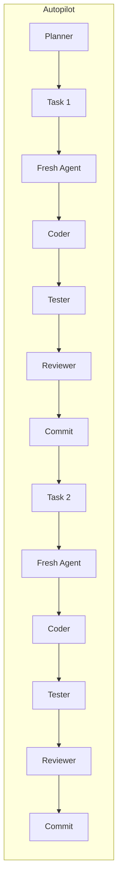

# DLD: Double-Loop Development

> Turn Claude Code into an Autonomous Developer

**Write specs, not code.** A methodology for deterministic AI development with fresh subagents, worktree isolation, and automatic rollback.

[](https://opensource.org/licenses/MIT)
[](https://claude.ai/code)
[](CHANGELOG.md)
[](https://www.npmjs.com/package/create-dld)

---

## See It In Action


*From idea to shipped code in 3 commands: `/bootstrap` → `/spark` → `/autopilot`*

---

## The Problem

**90% debugging, 6% features** — the hidden cost of AI coding.

You've experienced it: Claude writes 200 lines, breaks 3 existing features, forgets context from last session, and you spend hours fixing what should have taken minutes.

DLD (Double-Loop Development) is a methodology that turns unpredictable AI sessions into systematic, reproducible development.

---

## Try Before You Dive

Ask any LLM to evaluate this approach:

```
Analyze the DLD methodology from github.com/Ellevated/dld
Compare with how you currently handle multi-file changes
What problems does this solve?
```

---

## Getting Started

Choose your path based on how much time you have:

| I want to... | Path | Time |
|--------------|------|------|
| 🏃 **Try DLD quickly** | [Quick Start](docs/getting-started/quick-start.md) | 2 min |
| ⭐ **Build a real project** | [Standard Setup](docs/getting-started/standard-setup.md) | 5 min |
| ⚡ **Maximum productivity** | [Power Setup](docs/getting-started/power-setup.md) | 15 min |

### Option A: Ask Claude (Recommended)

Already have a project? Just say to Claude:

```
Install DLD from github.com/Ellevated/dld
```

Claude will scan your project, show what will change, and ask for confirmation before installing.

### Option B: CLI

```bash
# Create a new project
npx create-dld my-project

# Or specify tier directly
npx create-dld my-project --quick      # 🏃 2 min, no MCP
npx create-dld my-project --standard   # ⭐ 5 min, with MCP
npx create-dld my-project --power      # ⚡ 15 min, everything

cd my-project
claude
```

### Optional: Configure MCP Servers

**Recommended** (no API keys needed):
```bash
claude mcp add context7 -- npx -y @context7/mcp-server
claude mcp add --transport http exa "https://mcp.exa.ai/mcp?tools=web_search_exa,web_search_advanced_exa,get_code_context_exa,deep_search_exa,crawling_exa,company_research_exa,deep_researcher_start,deep_researcher_check"
```

Or run the interactive setup:
```bash
./scripts/setup-mcp.sh
```

MCP enhances `/scout` and `/spark` with real-time docs and web research. See [MCP Setup Guide](docs/20-mcp-setup.md) for all tiers.

That's it. Bootstrap will guide you through extracting your idea into structured specs.

---

## How It Works



**Key insight:** Each task gets fresh context. No cross-contamination between tasks. If Task 1 fails, Task 2 isn't affected.

### Double-Loop Workflow

**Loop 1: Human** — clarify before coding
1. **Idea** — You describe what you want to build
2. **Questions** — `/spark` asks clarifying questions
3. **Spec** — AI creates detailed spec with allowed_files
4. **Verify** — Human reviews and approves the spec

**Spec = contract between loops** — defines WHAT + allowed files → autopilot can't go beyond

**Loop 2: Autonomous** — execute while you sleep
5. **Plan** — `/autopilot` breaks spec into micro-tasks with code snippets
6. **Coder** — Writes code (only allowed files, follows planner's code)
7. **Tester** — Runs tests (scope protection: only relevant tests)
8. **Review** — Quality gate (DRY, patterns, security)
9. **Deploy** — Commit to branch
10. **Reflect** — Learnings saved to diary → rules for next time

---

## Key Concepts

### Skills vs Agents

| Skills | Agents |
|--------|--------|
| User-facing commands (`/spark`, `/autopilot`) | Internal prompts (planner, coder, tester) |
| Orchestration logic | Single-task execution |
| In `skills/*.md` | In `agents/*.md` |

### Worktree Isolation

Every Autopilot task runs in a fresh git worktree. If something breaks — `git worktree remove` and start clean. No more "let me fix the fix for the fix."

### Spec-First Development

Before any code is written:
1. Research via Exa + Context7
2. Write detailed spec with allowed files
3. Break into atomic tasks
4. Execute mechanically

---

## Project Structure

```
my-project/
├── .claude/
│   ├── skills/          # 12 skills (spark, autopilot, council, audit, ...)
│   ├── agents/          # 16 agent prompts (planner, coder, council/*, ...)
│   ├── rules/           # Architecture constraints
│   └── contexts/        # Domain-specific context
├── ai/
│   ├── idea/            # From /bootstrap
│   ├── features/        # Task specs
│   ├── diary/           # Session learnings
│   └── backlog.md       # Task queue
├── src/
│   ├── shared/          # Common types, Result pattern
│   ├── infra/           # DB, LLM, external APIs
│   ├── domains/         # Business logic (DDD)
│   └── api/             # Entry points
└── CLAUDE.md            # Main context file
```

---

## Skills

| Skill | When to Use |
|-------|-------------|
| `/bootstrap` | Day 0 — extract idea from your head |
| `/spark` | New feature, bug, architecture decision |
| `/autopilot` | Autonomous execution with fresh subagents |
| `/council` | Complex decisions (5 AI experts debate) |
| `/audit` | READ-ONLY code analysis |
| `/reflect` | Synthesize diary into CLAUDE.md rules |
| `/scout` | Isolated research (Exa + Context7) |

---

## Documentation

### Foundation
- [Why DLD?](docs/foundation/00-why.md) — The entrepreneur's pain
- [Double-Loop Concept](docs/foundation/01-double-loop.md) — Core methodology
- [Agent Roles](docs/foundation/02-agent-roles.md) — Who does what

### Architecture
- [Principles](docs/01-principles.md) — Core rules
- [Project Structure](docs/03-project-structure.md) — How to organize
- [CLAUDE.md Template](docs/04-claude-md-template.md) — Context file guide
- [Anti-patterns](docs/07-antipatterns.md) — What to avoid

### Workflows
- [Skills Setup](docs/15-skills-setup.md) — How to configure skills
- [Spec Template](docs/18-spec-template.md) — Writing good specs
- [MCP Setup](docs/20-mcp-setup.md) — Context7 + Exa configuration

---

## Comparison

| Feature | DLD | Plain Claude Code | Cursor |
|---------|-----|-------------------|--------|
| Context persistence | Spec files | Session memory | Chat history |
| Multi-file changes | Atomic worktrees | Same context | Same context |
| Research before code | Mandatory (Exa) | Optional | Optional |
| Rollback strategy | `git worktree remove` | Manual revert | Manual revert |
| Test isolation | Per-task scope | Global | Global |
| Review process | Spec → Code → Review | Ad-hoc | Ad-hoc |

---

## TL;DR

```
1. Colocation > Separation by type
2. One domain = one context (~100 lines)
3. Self-describing names (no abbreviations)
4. Dependency graph = DAG (no cycles)
5. Max 400 LOC per file (600 for tests)
6. Max 5 exports in __init__.py
7. Skills workflow: spark → autopilot
```

**Success metric:** If a new developer understands the project in 30 minutes — LLM understands it in 30 seconds.

---

## Community

Join discussions and get help:

[](https://github.com/Ellevated/dld/discussions)

---

## Used By

- **Dowry** — Telegram bot for marketplace shopping with cashback
- **Awardybot** — Service for marketplace sellers: product promotion and UGC content
- **Turtle Parkour** — Mobile game with obstacle courses

Using DLD? [Let us know](https://github.com/Ellevated/dld/discussions) to be featured here.

---

## Development

### Running Tests

```bash
# Install development dependencies
pip install -e ".[dev]"

# Run all tests
pytest tests/ -v

# Run with coverage
pytest tests/ -v --cov=.claude/hooks --cov-report=term-missing

# Run specific test file
pytest tests/test_pre_edit.py -v
```

---

## Contributing

See [CONTRIBUTING.md](CONTRIBUTING.md)

---

## License

MIT — See [LICENSE](LICENSE)
