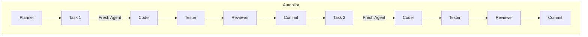

# TECH: [TECH-022] Workflow Diagram

**Status:** done | **Priority:** P3 | **Date:** 2026-01-24

## Problem

No visual diagram showing DLD workflow.
Users need to quickly understand: Spark → Autopilot → Done.

## Solution

Create workflow diagram using Mermaid (renders in GitHub README).

---

## Scope

**In scope:**
- Mermaid diagram in README
- Main workflow: idea → spark → autopilot → done
- Subagent flow inside autopilot

**Out of scope:**
- PNG/SVG generation (Mermaid is enough)
- Detailed internal flows

---

## Allowed Files

**ONLY these files may be modified during implementation:**

| # | File | Action | Reason |
|---|------|--------|--------|
| 1 | `README.md` | modify | Add Mermaid diagram |

**New files allowed:**

| # | File | Reason |
|---|------|--------|
| 1 | `assets/README.md` | Placeholder for future assets |

**FORBIDDEN:** All other files.

---

## Design

### Main Workflow Diagram

```mermaid
flowchart LR
    A[Idea] --> B[/spark]
    B --> C{Spec Ready?}
    C -->|Yes| D[/autopilot]
    C -->|No| B
    D --> E[Plan Subagent]
    E --> F[Coder]
    F --> G[Tester]
    G --> H{Tests Pass?}
    H -->|Yes| I[Reviewer]
    H -->|No| F
    I --> J{Approved?}
    J -->|Yes| K[Commit]
    J -->|No| F
    K --> L{More Tasks?}
    L -->|Yes| F
    L -->|No| M[Done]
```

### Subagent Flow



---

## Implementation Plan

### Task 1: Add Mermaid diagrams to README

**Files:**
- Modify: `README.md`

**Steps:**
1. Add "How It Works" section
2. Insert main workflow Mermaid diagram
3. Add brief explanation of each step
4. Optionally add subagent flow diagram

**Acceptance:**
- [ ] Diagram renders on GitHub
- [ ] Flow is clear
- [ ] Labels are understandable

### Task 2: Create assets directory placeholder

**Files:**
- Create: `assets/README.md`

**Steps:**
1. Create assets directory
2. Add placeholder README for future images

**Acceptance:**
- [ ] Directory exists
- [ ] README explains purpose

---

## Definition of Done

### Functional
- [ ] Workflow visualized
- [ ] Clear to new users
- [ ] Renders on GitHub

### Technical
- [ ] Valid Mermaid syntax
- [ ] Renders correctly

---

## Autopilot Log

*(Filled by Autopilot during execution)*
