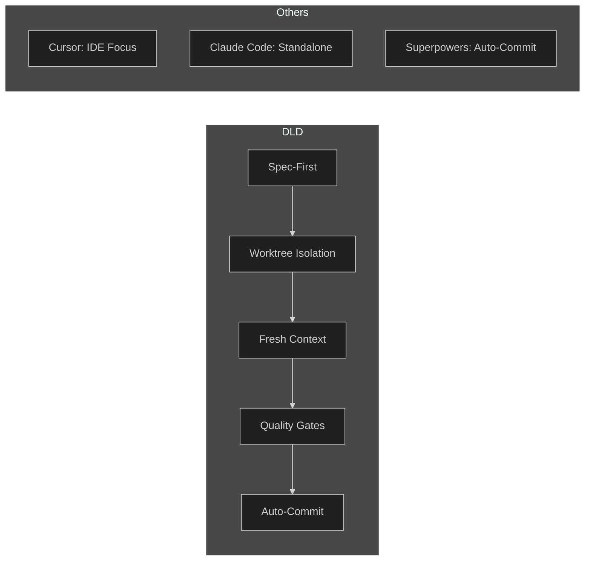

# DLD Comparison Table

Comparison table content and specifications for social media image generation.

---

## Table Content

| Feature | DLD | Cursor | Claude Code | Superpowers |
|---------|:---:|:------:|:-----------:|:-----------:|
| Spec-First Development | ✓ | - | - | - |
| Worktree Isolation | ✓ | - | - | ~ |
| Fresh Context Per Task | ✓ | - | - | ~ |
| Domain-Driven Structure | ✓ | - | - | - |
| Auto-Commit After Review | ✓ | - | - | ✓ |
| Quality Gates (Test + Review) | ✓ | - | - | ~ |
| IDE Integration | - | ✓ | - | ✓ |
| Works Standalone (CLI) | ✓ | - | ✓ | - |

**Legend:**
- ✓ = Full support
- ~ = Partial support
- \- = Not supported

---

## Image Specifications

### Dimensions

```
Twitter Card:     1200 x 630 px
LinkedIn Post:    1200 x 627 px
General Social:   1200 x 630 px (recommended)
```

### Color Palette

```
Background:       #1a1a2e (Dark navy)
Secondary BG:     #16213e (Slightly lighter)
Text (Primary):   #ffffff (White)
Text (Secondary): #a0aec0 (Gray)
Accent:           #4a9eff (Blue)
Checkmark:        #22c55e (Green)
X Mark:           #ef4444 (Red)
Partial (~):      #eab308 (Yellow/Amber)
```

### Typography

```
Font Family:      Inter, -apple-system, system-ui, sans-serif
Title Size:       32-36px, Bold
Header Row:       18-20px, Semibold
Body Text:        16-18px, Regular
Symbol Size:      20-24px (✓, -, ~)
```

### Layout Guidelines

```
Padding:          40px outer, 20px cell
Border Radius:    8px (table), 4px (cells)
Row Height:       48-56px
Header Height:    56-64px
Cell Alignment:   Center (symbols), Left (feature names)
```

---

## Alt Text (Accessibility)

**Short version:**
"DLD comparison table showing feature support vs Cursor, Claude Code, and Superpowers. DLD has full support for spec-first development, worktree isolation, fresh context, domain-driven structure, auto-commit, and quality gates."

**Long version:**
"Comparison table of AI coding tools. DLD supports: spec-first development (unique), worktree isolation (unique), fresh context per task (unique), domain-driven structure (unique), auto-commit after review (shared with Superpowers), and quality gates. Cursor provides IDE integration. Claude Code works standalone. Superpowers has IDE integration and auto-commit, with partial support for isolation and quality gates."

---

## Mermaid Alternative

For platforms that support Mermaid (GitHub, Notion):



---

## HTML/CSS Reference

For generating the actual image, use this HTML structure:

```html
<div class="comparison-table">
  <table>
    <thead>
      <tr>
        <th>Feature</th>
        <th class="highlight">DLD</th>
        <th>Cursor</th>
        <th>Claude Code</th>
        <th>Superpowers</th>
      </tr>
    </thead>
    <tbody>
      <tr>
        <td>Spec-First Development</td>
        <td class="check">✓</td>
        <td class="none">-</td>
        <td class="none">-</td>
        <td class="none">-</td>
      </tr>
      <!-- ... more rows -->
    </tbody>
  </table>
</div>

<style>
  .comparison-table {
    background: #1a1a2e;
    padding: 40px;
    font-family: Inter, sans-serif;
  }
  th { color: #4a9eff; }
  .highlight { background: #16213e; }
  .check { color: #22c55e; }
  .none { color: #ef4444; }
  .partial { color: #eab308; }
</style>
```

---

## Image Generation Options

1. **Screenshot Method:**
   - Create HTML page with styles
   - Screenshot at 2x resolution (2400x1260)
   - Export as PNG

2. **Figma/Canva:**
   - Use specs above
   - Export as PNG @2x

3. **CLI Tools:**
   - `pageres` or `puppeteer` for HTML to PNG
   - `carbon.now.sh` for code-styled tables

---

## Usage Notes

- Use PNG format for best quality on Twitter
- Keep file size under 5MB for Twitter upload
- Test contrast for accessibility (WCAG AA minimum)
- Include alt text when posting
